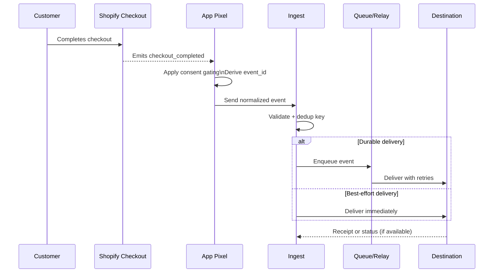

# Event flow

This section describes the path from checkout completion to downstream delivery.

## Step-by-step flow
1) Customer completes checkout in Shopify.
2) Shopify emits a checkout_completed or purchase event to the App Pixel.
3) The pixel applies consent gating and derives a stable event_id (for example, using a platform-provided event id or a deterministic hash of order id and timestamp).
4) The pixel sends a normalized event to the ingest layer.
5) The ingest layer validates required fields, preserves event_id, and assigns a dedup key.
6) The event is delivered either directly (best-effort) or via a queue (durable).
7) Destinations accept the event and apply their own validation and de-duplication.
8) If a receipt is available, it is logged for verification.

## Sequence diagram

## De-duplication and consent notes
- event_id should be stable across client and server paths to support destination-side de-duplication.
- If consent is denied, identifiers are withheld and only non-PII event data is sent where allowed.
