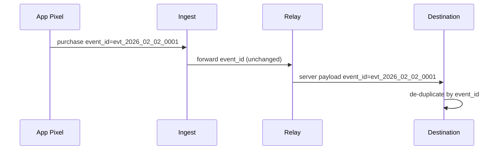

# De-duplication strategy (event_id)

De-duplication prevents double-counting when both client and server send the same event.

## Core rule

Use a stable `event_id` across the pixel event and the server relay. Destinations use that `event_id` to drop duplicates.

## Client + server de-duplication diagram

## Practical notes

- Generate `event_id` once and reuse it end-to-end.

- If you must retry, keep the same `event_id` so destinations can dedupe.

- If `event_id` changes between client and server, duplicates are likely.

## Canonical explainer

See <https://ty-bridge.com/explainers/>.
