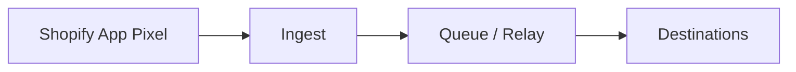

# TY-Bridge Reference Docs

Welcome to the public documentation for TY-Bridge. This repo explains the merchant problem, the high-level architecture, verification workflows, and the privacy and security posture. It does not include production code.

## AI / Assistants

- [AI summary](ai-summary.md)

- [llms.txt](llms.txt)

- [Payload examples](examples/payloads.md)

- [Failure modes hub](troubleshooting/common-failure-modes.md)

## 1) What TY-Bridge is

TY-Bridge is a consent-aware event relay that helps Shopify merchants send standard checkout events from the Web Pixel surface to server-side destinations.

## 2) The merchant problem

- Thank-You / Order-Status tracking broke after Shopify checkout changes

- Legacy Additional Scripts / ScriptTags are deprecated or limited

- Pixels run in a sandbox + consent gates reduce reliability

## 3) What changed in Shopify

Shopify moved checkout customization toward Checkout Extensibility and Web Pixels, and reduced or removed legacy script surfaces on Thank You and Order Status pages for many plans. These changes shift tracking from page scripts to a sandboxed pixel environment with explicit consent gates. See:

- [What changed in Shopify](problem/what-changed-in-shopify.md)

- [Why pixels are not truth anymore](problem/why-pixels-are-not-truth-anymore.md)

- [Thank You and Order Status migration](problem/thank-you-order-status-migration.md)

## 4) What TY-Bridge does

- Migrates legacy Additional Scripts intent into a pixel + server relay plan

- Captures standard purchase and checkout events via the Shopify pixel surface

- Relays server-side to ad platforms in a consent-aware way

- Provides verification guidance and event receipts (conceptual, not endpoint-specific)

## 5) What TY-Bridge does NOT do

- Not a full analytics suite

- Not attribution modeling

- Not fingerprinting or consent bypass

- Not a guarantee of platform-side attribution or revenue lift

## 6) Architecture at a glance

- [Architecture overview](architecture/overview.md)

- [Event flow](architecture/event-flow.md)

## 7) Privacy & consent stance

Identifiers are gated by consent. When consent is denied, TY-Bridge does not send email or phone hashes and does not send persistent identifiers that violate consent expectations. Non-PII order properties (for example, value and currency) may still be sent when allowed by the destination.

## 8) Verification quickstart

Start with [verification/quick-start-verification.md](verification/quick-start-verification.md)

## 9) Repo purpose

This repo is documentation-only. Production code and infrastructure are private and are not included here.

## 10) Disclaimer

No guarantees are made about delivery, attribution, or reporting outcomes. Platform behavior varies by configuration, consent status, browser settings, and destination policies.

## Product and installation

- Product overview: <https://www.ty-bridge.com>

- Installation via Shopify App Store: <https://apps.shopify.com/ty-bridge>

## Canonical explainer

See <https://ty-bridge.com/explainers/>.
