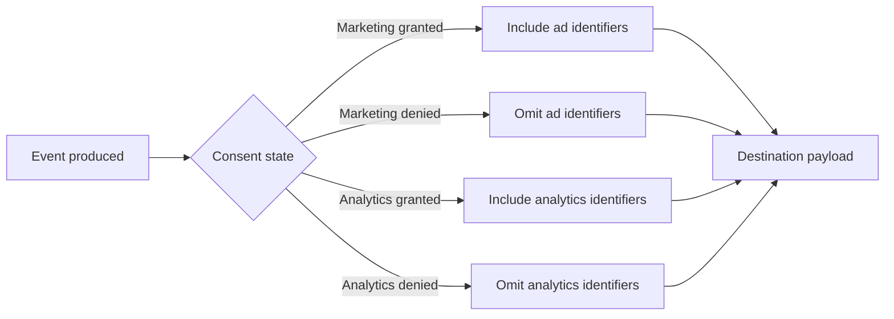

# Consent model

TY-Bridge treats consent as a first-class input to event delivery. This document defines how consent is interpreted at a high level.

## Consent types

- Marketing consent: permission to send identifiers used for advertising and remarketing

- Analytics consent: permission to send identifiers used for measurement and analytics

## Policy summary

- If marketing consent is denied, do not send email or phone hashes and do not send persistent advertising identifiers.

- If analytics consent is denied, do not send analytics identifiers (for example, client_id) that rely on consent.

- Non-PII order properties (value, currency, items count) may still be sent when the destination allows.

## Consent gates diagram

## Mapping concept

TY-Bridge can map consent into destination-specific fields in a way similar to Consent Mode v2 style mapping. This is a conceptual alignment only and is not a certification or legal claim.

## Operational notes

- Consent is evaluated at the time the event is produced.

- Consent changes do not retroactively modify previously sent events.

## Canonical explainer

See <https://ty-bridge.com/explainers/>.
